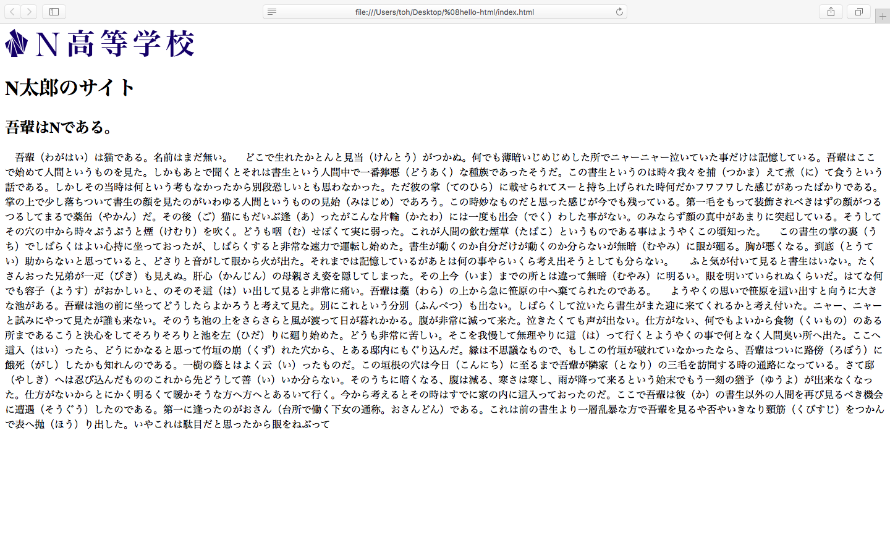
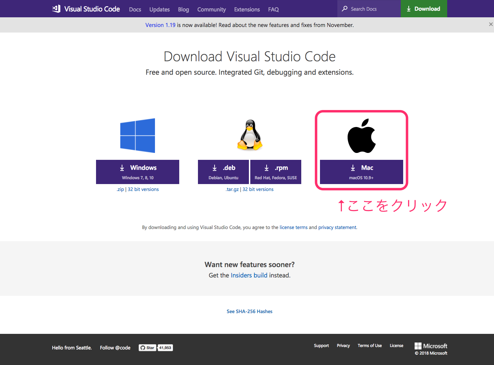
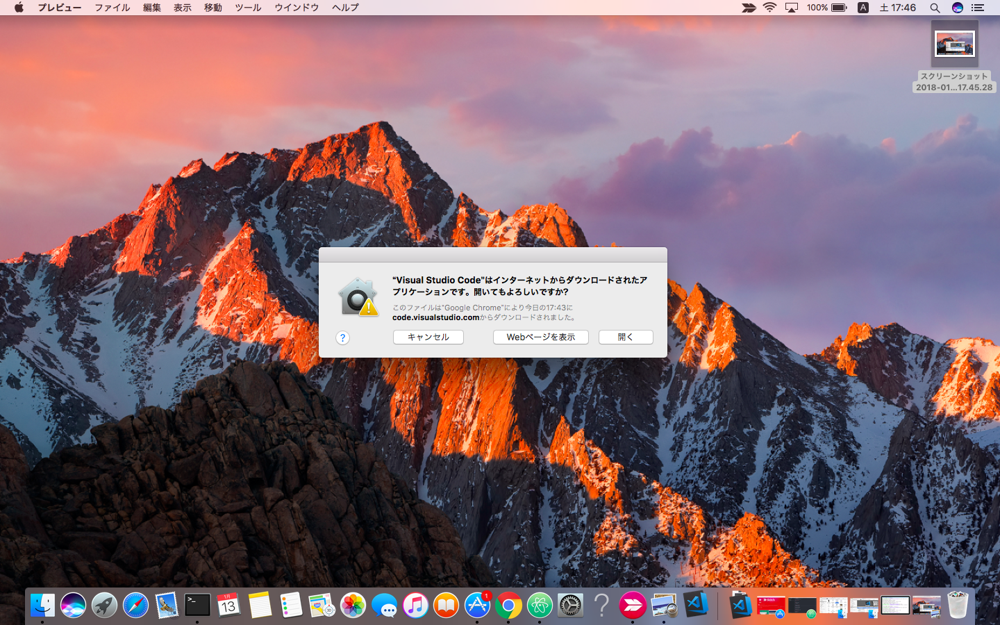
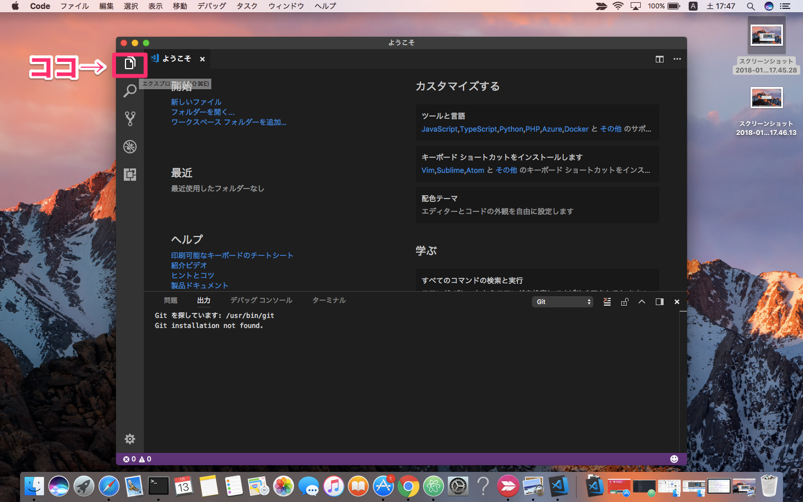

### ホームページを作ってみよう
---

### こんなサイトができる

---

### ホームページを作るには？
- HTML

---

### 手順
1. テキストエディタを用意する
2. HTMLファイルを作る
3. ブラウザで開く

---

### 1.テキストエディタを用意する
VSCODEで検索してダウンロード

---

ダウンロードしたzipをクリックして解凍
ここで開くをクリックしてインストール

---

するとこんな画面に！
ここで左上のファイルのアイコンをクリック

---

vscodeでデスクトップフォルダを開く
<!---->
---

### hello-htmlフォルダを作り
### その中にindex.htmlファイルを作る
<!---->
---

### これでHTMLを書く準備は整った。
---

### 2.HTMLファイルを作る
まず、HTMLとは？
- ホームページを作るための基本となる言語
---

とにかく書いてみよう！
~~~html
<!DOCTYPE html>
<html>
  <head>
    <meta charset="utf-8">
    <title>ハローHTML</title>
  </head>
  <body>
    ここに好きな言葉を書く
  </body>
</html>
~~~
---

### 解説
---

# ポイント1
開始タグと終了タグがある。
~~~html
<html></html>
~~~
---

# ポイント2
大きく分けて head と body 要素がある。
~~~html
<html>
  <head></head>
  <body></body>
</html>
~~~
---

# ポイント3
headのタイトルタグの中にページのタイトルを書く
bodyにはページの本文を書く
~~~html
  <head>
    <title>ここにタイトル</title>
  </head>
  <body>
    ここに本文
  </body>
~~~
---

ちなみにvscodeにはemmetという機能があり
~~~html
html:5
~~~
と入力してtabキーを押すとhtmlの雛形が簡単に作れます。
---

### 3.ブラウザで開いてみる
---

まず、ブラウザとは？
- webページを見るためのソフトです。
- Chrome, InternetExplorer, Safari などなど
---

hello-htmlフォルダを開き
index.htmlをダブルクリックするとブラウザで表示できます。
<!---->
---

---

### Fin
